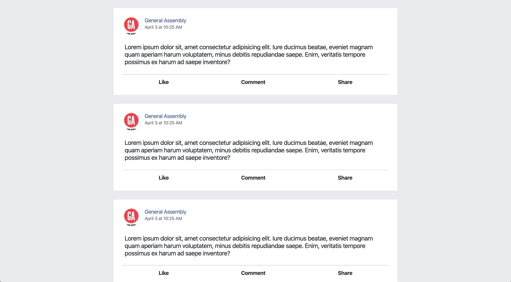

# React Props Lab: Facebook Timeline

In this lab, you'll be creating a Facebook timeline with multiple statuses, but as little repeated code as possible!

1. Fork and clone this lab.
1. `cd` into the repository you cloned.
1. Run `npm install` to install your dependencies.
1. Run `npm run start` to get your server up and running.
1. Open up your text editor, and checkout `src/Timeline.js`. Right now, there's React code for one hardcoded status. We're going to refactor this code so that there is a `Timeline` component that renders multiple `Status` subcomponents.
  1. Create a new file `Status.js` and create a React component in that file. Don't forget to import `React` and to export the component!
  1. Move everything inside the `.status` element in the `Timeline` component into your new `Status` component.
  1. Import and render your new `Status` component within your `Timeline` component.
1. Render three `Status` components inside your `Timeline` component. Right now all of them will have the same text and user information. Let's make that information dynamic.

  1. Make the status text into a `prop`. Pass different status text to each of your statuses.
  1. Make the profile pic into a `prop`. Pass different profile pic links to each of your statuses. You can just pull an image from the internet!
  1. Make the username into a `prop`. Pass different usernames text to each of your statuses.
  1. Make the post date into a `prop`. Pass different dates text to each of your statuses.

🙌🏻 Awesome! Now you should have a timeline that renders three different statuses made by three different users at different times!

## Hungry for More

1. Break down the status component into more subcomponents, for example a `UserInfo` component, a `StatusText` component, and a `ReactionBar` component.
1. Create a `Header` component that looks like Facebook's nav bar.
1. Look into [conditional rendering](https://reactjs.org/docs/conditional-rendering.html) and add a `read more` button if the status is over 200 characters long.
